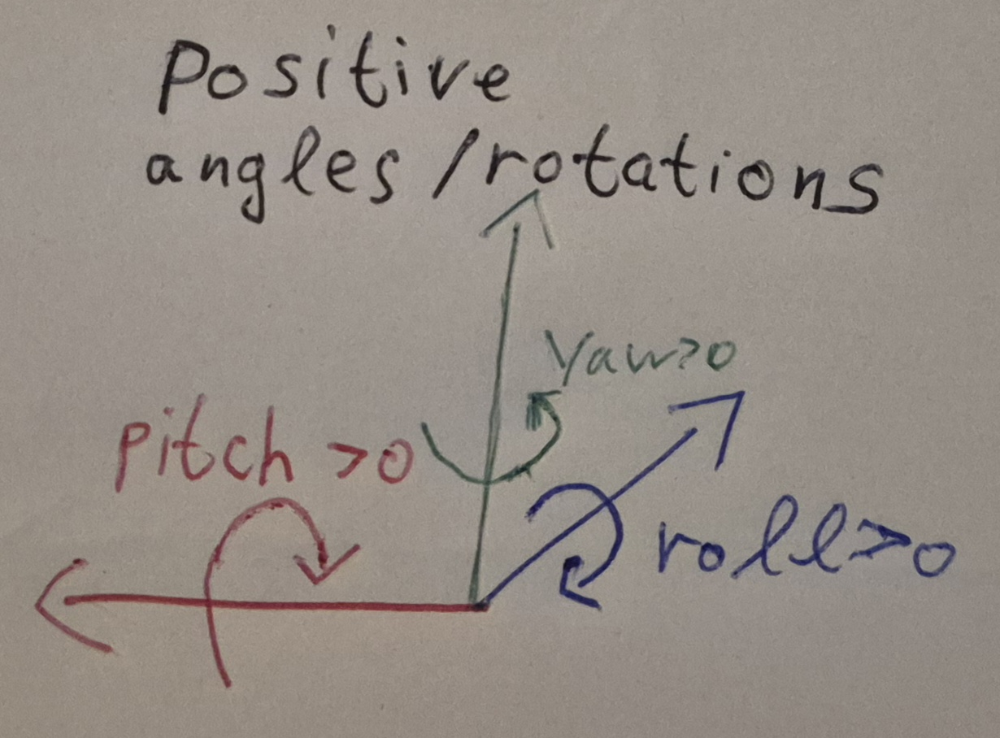
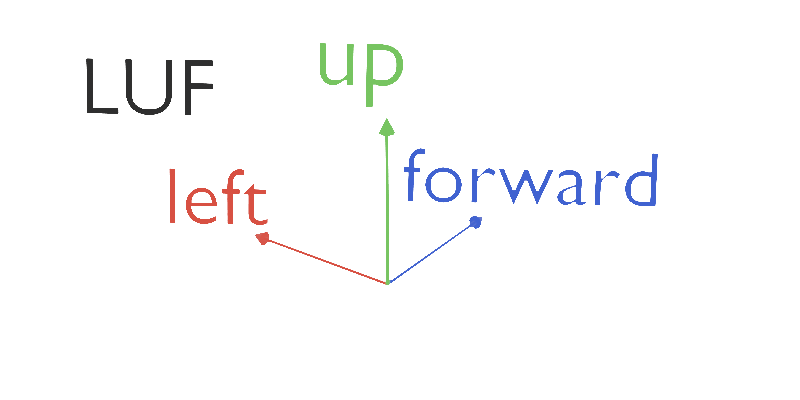
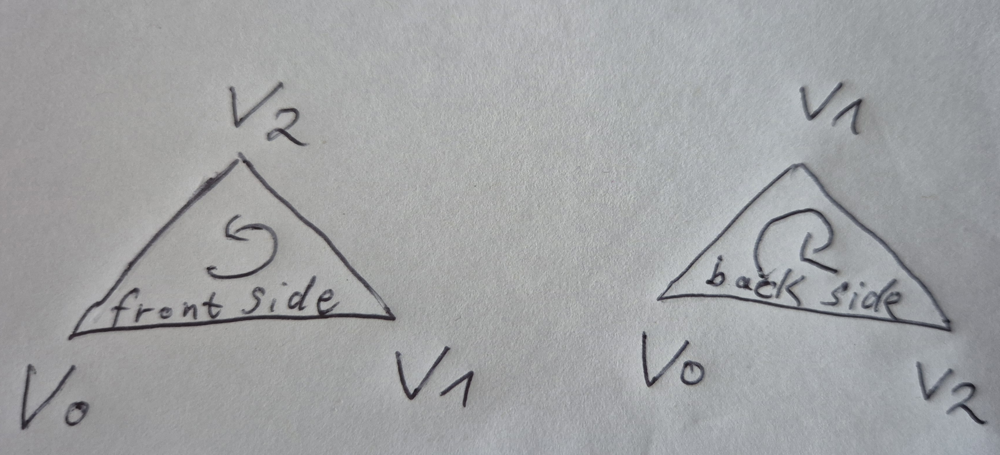
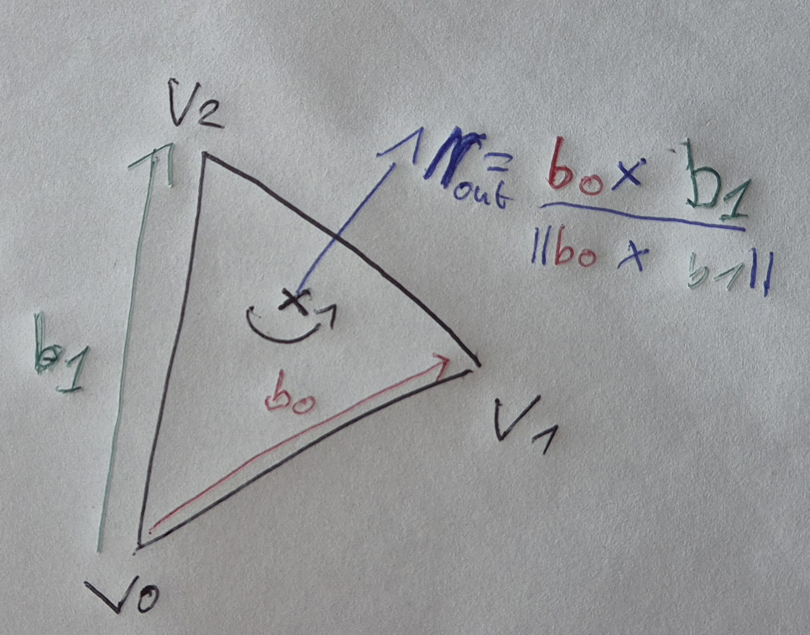
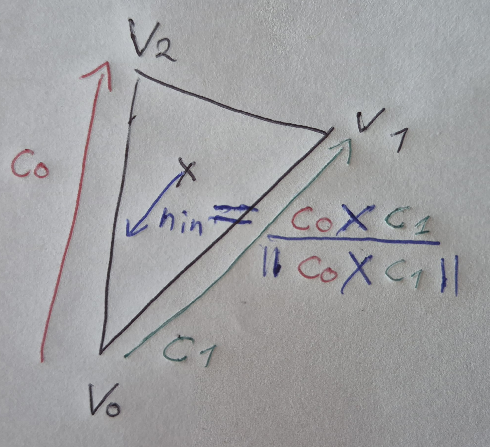
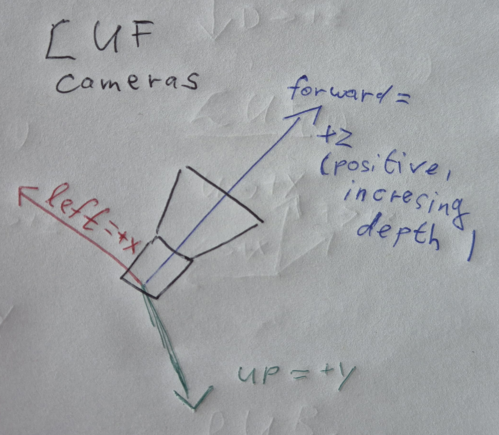
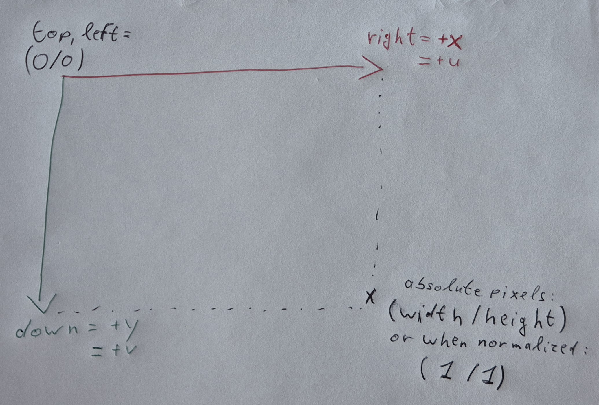

# Advanced Content Engine (ACE) Code

When using our advanced content engines (ACEs),
it is important to know what standards and conventions to expect.
The Ace framework is build on the following set of conventions.

## Conventions

### Units

To avoid bugs where values with units are mistakingly interpreted using the wrong unit,
the system internally uses always the same units
(unless there is a good reason to do otherwise).
The internally used units are:

* distances are in meter (1.0 for a length variable means 1m)
* angles are in radians (non-user interface code expects angles radians)
* time is in second (1.0 for a time variable means 1s)
* weight is in kilogram (1.0 for a weight variable means 1kg)

### Right-handed Coordinate Systems and the Meaning of Angles

Angles and coordinate systems all follow the
[right-hand rule](https://en.wikipedia.org/wiki/Right-hand_rule).
The right-hand rule and right-handed coordinate systems are common
in publications and educational materials.

The [right-hand rule](https://en.wikipedia.org/wiki/Right-hand_rule)
for our convention system means:\

* Angles have positive values
  when their rotation appears clockwise
  while looking in the positive direction of the axis.
  In contrast, the angle value is negative
  if the rotation appears clockwise
  while looking along the negative direction of the axis.
  Similarly, the angle is negative if they appear counter-clockwise
  while looking along the positive direction of the axis.
  See
  [wikipedia's angle definitions](https://en.wikipedia.org/wiki/Euler_angles#Signs,_ranges_and_conventions)
  or
  [mathworld.wolfram](https://mathworld.wolfram.com/CoordinateSystem.html)
  for more details.
* When working with our 3D coordinate system basis consisting of
  the unit-length orthogonal axes b0, b1 and b2 (in this order),
  then the corss product "x" is defined as $b_2 = b_0 x b_1$.
* The determinant of the basis matrix $B = (b_0, b_1, b_2)$ is positive and 1:\
  $|B| = |(b_0, b_1, b_2)| = 1$.
* The basis vectors are also often called
  * $b_0 = x = (1,0,0)$,
  * $b_1 = y = (0,1,0)$,
  * $b_2 = z =(0,0,1)$.

As mentioned above, the default unit for angles is radians.
Most math functions expect angles in radians (and not degrees).
Angles in degrees are only used at the outermost level
when allowing for user-friendly input. That includes for example a GUI that allows users to input angles in degrees,
which are then directly converted to radians.

### Linear Algebra Conventions

#### Vectors

* Vectors are considered to be in column layout.
For more details, see
[row and column vectors](https://en.wikipedia.org/wiki/Row_and_column_vectors).

#### Matrices

* Matrices are build
  for multiplication by column vectors and usually for
  [pre-multiplication](https://en.wikipedia.org/wiki/Rotation_matrix#Ambiguities).
  This is different from conventions usually followed when working with Direct3D.
  Our conventions are the same as when working with
  typical Vulkan, OpenGL code or common linear algebra taught at universities.
* The application/concatenation/execution order of matrices is
  right to left or inner to outer matrix.
  * The vector $v' = M * N * v$ considered a column vector,\
    first transformed by N and second transformed by M.
  * The latter transformation broken down is as follows:\
    $v' = M * v_n$ and $v_n = N * v$, $r_0$, $r_1$, $r_2$ are the rows of N:
    * $v_n.x = r_0 * v$
    * $v_n.y = r_1 * v$
    * $v_n.z = r_2 * v$ and
    * $*$ is the dot/inner product $r  * v = r.x * v.x + r.y * v.y + r.z * v.z$
  * If you are used to Direct3D and row vectors followd by matrices,
    then this code basically implements the transposed version:\
    ${(v')}^t = v^t * N^t * M^t = M * N * v$\
    with $M^t$ = transpose($M$),
    $N^t$ = transpose($N$),
    $v^t$ = rowVector($v$) and
    ${(v')}^t$ = rowVector($v'$).

#### Quaternions

* Quaternions follow the Hamilton product
  (NOT the Shuster/JPL/Direct3D multiplication convention).
  See
  [wikipedia's rotation conventions](https://en.wikipedia.org/wiki/Quaternions_and_spatial_rotation#Software_applications_by_convention_used).
* When combining quaternions, the application/concatenation/execution order
  of the quaternions is right to left or inner to outer quaternion.
  This means $q' = q_1 * q_0$ means that
  $q'$ models first applying $q_0$ and then applying $q_1$.
* If $q_1$ and $q_0$ are unit quaternions and represent rotations,\
  then $q'=q_1 * q_0$ is a rotation with\
  $v'$ = $q'$.rotateVector($v$).\
  That means
  $v$ is first rotated by $q_0$ and then rotated by $q_1$ resulting in $v'$.\
  This is strongly related to using column vectors and
  right-to-left multiplication order for matrices.

#### W Comes Last

When vector, matrix or quaternion components are accessed, then the elements are always in xyzw order.
That means w always comes last.
q = Quaternion(x, y, z, w) and the storage order of q's elements is x first, y second, z third and w last.
The same is true for vectors:
v = Vector4(x, y, z, w) and the storage order of v's elements is x first, y second, z third and w last.
Similarly, the x-axis of a matrix is the first column vector of the matrix and the w-axis of a the matrix is the 4th column vector of the matrix.

### Graphics and Geometry Conventions

Unfortunately,
many various graphics coordinate system conventions are followed
depending on the author(s) or API and they are often not consistent.
Look at this [varying set of conventions](https://github.com/SamirAroudj/AceNerds/tree/main/Software/03TheMessOf3DBases#conventions-used-in-practice) for example.
When looking at a scene, object, mesh, texture, etc. multiple conventions must be defined:

* Where is the origin of the coordinate system?
  For examples for 2D image coordinate systems it might be the upper left or lower left corner.
* What do angles and rotations mean when applied to the current coordinate system,
  i.e., is it a right- or left-handed coordinate system?
* How do the axes look like for 3D scene coordinate systems?
  * Which axis goes to the left or right, the positive/negative x-axis, y-axis or z-axis?
  * Which axis goes up, the z-axis or y-axis... or even the x-axis?
  * Which axis goes forward and what does backward mean?

The main goal of this projects convention system is internal consistency.
This means that this project is focused on consistently
following the same convention set.
This sometimes results in less common conventions and
in a few rare cases blind consistency is quite impractical.
However, once you are familiar with the basic assumptions,
the overall convention system is less confusing and
easier to understand and follow.
The basic assumptions are detailed next.

#### Axes with Meaning

The project is built on coordinate axes
with a context-dependent meaning if possible.
That means left/right, up/down and forward/backward are preferred
over directly using +/- x, y and z.
This additional abstraction layer reduces confusion and
makes converting coordinates at least somewhat easier.
If you only look at an isolated fundamental math/geometry library,
these attached meanings are not common as they do not make sense without context.
However, once you employ your math library
in a specific context (graphics, physics, etc.),
it is useful to define this additional
layer for a more user friendly and consistent API.
To clarify what is used here
the meaning of the coordinate system basis and their axes are explained next.

#### Right-handed 3D LUF World and Child Coordinate Systems

3D scene coordinate systems are
[right-handed](https://en.wikipedia.org/wiki/Right-hand_rule)
to be consistent with the choices explained earlier.
This is true for the world coordinate system and
all its child/successor coordinate systems (for cameras, sub scenes or objects).

The 3D scene coordinate system is build of three orthogonal and
unit-length vectors in the following order:

1) the left axis (L) which maps to $+x = (1, 0, 0)$, colored red;
2) the up axis (U) which maps to $+y = (0, 1, 0)$, colored green;
3) the forward axis (F) maps to $+z = (0, 0, 1)$, colored blue.

Correspondingly, the negative directions of the 3D basis axes go
1) right (R) mapping to $-x = (-1, 0, 0)$,
2) down (D) mapping to $-y = (0, -1, 0)$ and
3) backward (B) mapping to $-z = (0, 0, -1)$.

In short, the underlying 3D basis follows the
right-handed left-up-forward
[(LUF) coordinate system convention](https://github.com/SamirAroudj/AceNerds/tree/main/Software/03TheMessOf3DBases#conventions-used-in-practice):\

This choice of coordinate system convention is [quite arbitrary](https://github.com/SamirAroudj/AceNerds/tree/main/Software/03TheMessOf3DBases#blender-and-lbu)
except that we want the code to be consistent
with what other successful software projects follow:

* Epic's Unreal Engine for Fortnite (UEFN)
* future Unreal Engine versions are supposed to follow this convention
* GLTF 2.0 and later
* Houdini
* Maya
* Microsoft Kinect
* see
  [this overview](https://github.com/SamirAroudj/AceNerds/tree/main/Software/03TheMessOf3DBases#conventions-used-in-practice)
  or Math/Conventions/Conventions.h for our overview of convention systems

### Counter-clockwise Winding Order for Front Faces

This is again based on the right-hand rule.
Mesh triangles/faces' front sides are considered
where their vertices go in counter-clockwise order (left example).
This means
if your fingers point along the winding order (counter-clockwise),
then your thumb points out of the triangle front face.
Triangles/faces seen to have clockwise vertex winding order
(left-hand rule example on the right side)
are considered to be seen from the back.
Faces with clockwise winding order are ususally culled
in the rendering pipeline and not drawn to the screen:\

The right-hand rule is also applied to triangle normals as
triangle normals are computed using the vertex winding order too.
If the vertices $v_0$, $v_1$, $v_2$ of a triangle appear in counter-clockwise order,
then the outside normal is:

* $b_0 = v_1 - v_0$ -> right thumb direction
* $b_1 = v_2 - v_0$ -> right index finger direction
* $n_{out} = normalize(crossProduct(b_0, b_1))$ \
  -> right middle finger direction

Conversely, inside facing normals are computed using the left-hand rule and clockwise order:
* $c_0 = v_2 - v_0$ -> left thumb direction
* $c_1 = v_1 - v_0$ -> left index finger direction
* $n_{in} = normalize(crossProduct(c_0, c_1))$\
  -> left middle finger direction

#### Naming Conventions

LS is short for local space.
Local space refers to the coordinate system of a node in a chain of transformations.
The local space transform $M_{LS}$ of node $n_i$ converts a point or direction
in the local space of node $n_i$
into the coordinate space of its direct parent node $p(i)$.
For example,
in a skeleton tree for character animation a finger tip leaf node
has its own local space transform converting
from the finger tip to the coordinate frame of the parent finger middle part.

OS is short for outer space.
The outer space (OS) of an entity refers to the outer coordinate system
surrounding/outside of the entity or
in which the entity is placed.
For example in context of a transform tree or skeleton,
the outer space transform $M_{OS, i}$ of node $n_i$ in a tree with root node $n_r$
is the chain of transforms up the whole tree.
The chain of transforms starts with $n_i$'s local space transform $M_{LS,i}$
and ends with (including) the root node $n_r$'s local space transform $M_{LS, r}$:\
$ M_{OS,i}= M_{LS,r} * ...* M_{LS,p(i)} * M_{LS,i}$.\
That means OS transforms are "global" and relative to some outer space
in constrast to the local space transforms.
(Outer space is the same as local space if the node has no parent,
i.e., if it is a root node.)

#### Camera Coordinate Systems

Camera systems are again
[right-handed LUF (left-up-forward)](https://github.com/SamirAroudj/AceNerds/tree/main/Software/03TheMessOf3DBases#conventions-used-in-practice).
They look along the forward (third) axis.
The front of the camera is where it receives light.
That means the camera points towards the forward axis
and thus depth or viewing distance increases with +z.
The second camera coordinate axis is up.
The first coordinate system axis must go left for right-handedness:\

#### Right-Down (RD) Screen Space, Image & UV-Coordinate Systems

The **origin = (0, 0)** is at the **top left = memory start = 1st pixel** corner.
The 1st axis is horizontal and goes from left to right.
The 2nd axis is vertical and goes from top to bottom.
This means the axes go from (0, 0) to (width/height) or (1/1):\

The lowest memory address of
a fragment in a frame buffer or a pixel in an image/texture
(1st element in memory) refers to the origin at (0, 0).
Since frames are usually rendered in scanline order
from left to right and top to bottom row by row and
since images are often stored in linear memory the same way,
this means the origin (0, 0) is at the top left.
Note that this convention of
the origin being at (0, 0) and referring to the top left corner
inverts the second axis in comparison to 3D coordinate systems.
However, this seems to be a common convention of rendering engines
for screen space, images and textures.
For example, see the *engine* (not editor) or rendering API coventions:

* [Direct3D](https://learn.microsoft.com/en-us/windows/win32/direct3d10/d3d10-graphics-programming-guide-resources-coordinates),
* [GoDot](https://docs.godotengine.org/en/stable/_images/iconuv.png),
* [OpenCV](http://www.anandmuralidhar.com/blog/tag/opencv/),
* [UnrealEngine](https://www.aclockworkberry.com/uv-coordinate-systems-3ds-max-unity-unreal-engine/) or
* [Vulkan](https://docs.vulkan.org/tutorial/latest/08_Loading_models.html).

This convention is also chosen to avoid conversion during runtime,
and have the simplest mapping from coordinates to memory addresses
(memory addresses increase with the row or column index).
If conversions are necessary,
they are rather done in an "offline" content creation tool.

**2D Projections and Screen Space**:\
The same 2D basis convention system is in use
when projecting 3D coordinates to the 2D image plane of the main window/screen
or when working with inherent 2D screen coordinates (mouse, other pointers & GUI).
The coordinate system orgin (0, 0) is at the top left corner.
The bottom right corner of the screen space is at the maximum ends.
The first axis is the right axis and corresponds to +x (+x goes right).
The second axis is the down axis and corresponds to +y (+y goes down).

The mouse coordinates are relative to this coordinate system.
That means if the mouse cursor is at the top left corner,
then its position is (0, 0).
If the mouse cursor is at the bottom right corner of the screen
then it the cursors pixel coordinates are (width, height)
and its normalized coordinates are (1, 1).

**Image Coordinate System**:\
Image coordinate systems follow the same convention
as the screen space coordinate system.
The origin (0, 0) is at the top left corner.
The first axis is the x-axis.
+x goes from left to right.
The second axis is the y-axis.
+y goes from the top of the image to its bottom.

**Textures**:\
Textures also follow the right-down basis convention,
but with differently named axes ($u,v$ instead of $x,y$).
The first axis is the $u$-axis.
$+u$ goes from left to right.
The second axis is the $v$-axis.
$+v$ goes from the top of the texture to its bottom.

Tools instead tend to prefer a $uv$ origin at the bottom left corner, e.g.,:

* [Autodesk 3ds Max](https://www.aclockworkberry.com/uv-coordinate-systems-3ds-max-unity-unreal-engine/),
* [Blender](https://alek-tron.com/TextureOrigins/TextureOrigins.html),
* [Houdini](https://www.sidefx.com/docs/houdini/nodes/vop/mtlximage.html),
* [OpenGL](https://www.puredevsoftware.com/blog/2018/03/17/texture-coordinates-d3d-vs-opengl/)
* [Unreal Engine's editors](https://dev.epicgames.com/documentation/unreal-engine/uvs-category-in-unreal-engine?application_version=5.1) or
* [Unity](https://www.aclockworkberry.com/uv-coordinate-systems-3ds-max-unity-unreal-engine/).

There is this useful rule of thumb:
Rendering engines seem to prefer the top left corner as origin and RD 2D frames.
Asset editors prefer the bottom left corner as origin and RU frames.\

## Requirements: OS, Tools and Libraries

### Operating Systems

The code is designed to run on Linux and Windows.
When running rendering code on Linux,
make sure your system uses Wayland and not X11.

### Tools and Libraries

Ace requires the following tools and libraries for building:

* Ninja, CMake, Clang  or gcc (linux) for building the C/C++ code
  * this code [has been built and tested using CMake, Ninja and GCC or Clang](https://github.com/SamirAroudj/AceNerds/blob/main/Software/01VSCodeMSYS2ClangWindows/README.md)
  * it might/might not work with a different tool chain
* depending on what features you turn on in [CMake](https://cmake.org/),
  you will need further dependencies:
  * [cuda](https://developer.nvidia.com/cuda-downloads)
  * [Dear ImGui](https://github.com/ocornut/imgui)
  * [embree4](https://www.embree.org/)
  * [fastgltf](https://github.com/spnda/fastgltf)
  * [jsoncpp](https://github.com/open-source-parsers/jsoncpp)
  * [libjpeg-turbo](https://libjpeg-turbo.org/)
  * [OpenMP](https://www.openmp.org/)
  * [pybind11](https://github.com/pybind/pybind11)
  * [python3](https://www.python.org/downloads/)
  * [pytorch](https://pytorch.org/)
  * [SDL3](https://wiki.libsdl.org/SDL3/FrontPage)
  * [STBImage](https://github.com/nothings/stb/blob/master/stb_image.h)
  * [tinyobjloader](https://github.com/tinyobjloader/tinyobjloader)
  * [Vulkan](https://vulkan.lunarg.com/sdk/home)
  * [ZLib](https://zlib.net/)

## Abbreviations

* cam = camera
* cmd = command in context of a command line API or command buffers
* coord = coordinate in context of coordinates representing a position, texture UV coords, etc.
* dir = direction in context of geometry, e.g., lineDir
* e = edge in context of a graph, geometry or meshes, e.g., eNeighbors
* ele = element in context of arrays, containers, images, textures and similar
* ib or IB = index buffer in context of geometry or meshes
* idx = index
* inv = inverse, in context of a mathematical function, e.g., inverse rotation invRot
* LS = local space in context of coordinates/spaces, e.g., bonePoseLS
* LoD = level of detail in context of rendering, e.g., level of detail for mipmap use
* mem = memory in context of memory blocks or barriers
* MS = model space in context of coordinates/spaces, e.g., vertexPositionMS
* msg = message in context of logging or exception handling
* n = normal in context of geometry/shaders, e.g., planeN
* NNXS = non-normalized X space, e.g., NNTS = non-normalized texture space, NNPS = non-normalized pixel space
* param = parameter in context of configuration files or structs, function parameters, etc.
* proj = projection in context of cameras or projection matrices
* pos = position in context of coordinates, e.g., cameraPos
* rot = rotation in context of space/transforms, e.g., objectRot
* src = source in context of data transfer or pipeline stages
* stats = statistics in context of data measurements or in general data statistics
* t = triangle in context of geometry/meshes, e.g., tNeighbors
* tex = texture in context of graphics with images
* tgt = target in context of data transfer or pipeline stages
* TS = texture space in context accessing textures or using texture samplers
* v = vertex in context of geometry/meshes, e.g., vColor or vCol
* vCol or VCol = vertex color in context of render pipelines and vertex attributes
* VS = view space in context of coordinates/spaces, e.g., positionVS
* vb or VB = vertex buffer in context of geometry or meshes
* WS = world space in context of coordinates/spaces, e.g., orientationWS
