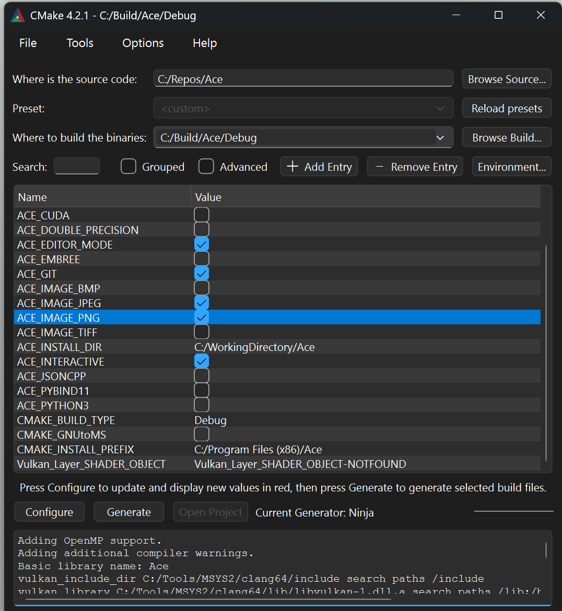
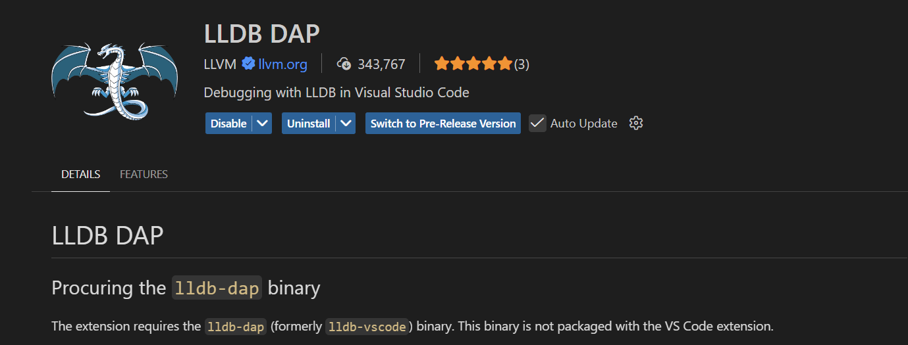

# VSCode and Clang under Windows

[VSCode](https://code.visualstudio.com/) can be a really powerful and versatile tool with many available extensions.
You can for example use it together with multiple operating systems including the main ones: Windows, MacOS and Linux.
You can even set up and define your preferred build [toolchain](https://en.wikipedia.org/wiki/Toolchain) in detail.
If you are however used to [IDEs](https://en.wikipedia.org/wiki/Integrated_development_environment)
which are very straightforward to use,
but somewhat less configurable (e.g., VisualStudio),
it can be somewhat annoying until you find out how to set everythin up in [VSCode](https://code.visualstudio.com/) until you can work productively.
This tutorial will fast-track your efforts to setup your [clang](https://clang.llvm.org/) and [VSCode](https://code.visualstudio.com/)-based build environment under Windows.

## Installing VSCode, MSYS2 & Required Packages

These steps will get the compiler called [clang](https://clang.llvm.org/) and
the package and build environment manager [MSYS2](https://www.msys2.org/) working on your Windows:

* [Download](https://code.visualstudio.com/download) & install [VSCode](https://code.visualstudio.com/) which is the [IDE](https://en.wikipedia.org/wiki/Integrated_development_environment) for this tutorial.

* [Download](https://www.msys2.org/) & install the [MSYS2](https://www.msys2.org/) command line tool for Windows.
  * [MSYS2](https://www.msys2.org/) comes with multiple [environments](https://www.msys2.org/docs/environments/) / executables.
  * Make sure you start the “MSYS2 CLANG64” executable (`<MSYS2 install dir>/clang64.exe`) to work with the environment for the [clang compiler](https://clang.llvm.org/);\
  you should see a [MSYS2](https://www.msys2.org/) window with `username@machine CLANG64 ~` as initial text:\
  
  * [Pacman](https://www.msys2.org/docs/package-management/) is the package manager within [MSYS2](https://www.msys2.org/) which facilitates getting the headers and binaries you will need.
  * [Installing a package](https://www.msys2.org/docs/package-management/) in [MSYS2](https://www.msys2.org/docs/package-management/) is done using a command like:

    ```bash
    pacman -S  <package_name>
    ```

  * Finding available packages can be done using a command like:

    ```bash
    pacman -Ss  <part of the package name>
    ```

  * For example, to find the [JsonCpp](https://github.com/open-source-parsers/jsoncpp) package, try:

    ```bash
    pacman -Ss jsoncpp
    ```

  * Listing all installed packages can be done using the command:

    ```bash
    pacman -Q
    ```

* [Download](https://www.mingw-w64.org/getting-started/msys2-llvm/) & install
  the [clang compiler](https://clang.llvm.org/) & [debugger](https://lldb.llvm.org/) from [LLVM](https://llvm.org/)
  using [pacman](https://www.msys2.org/docs/package-management/) like so:
  * First, get the [clang compiler](https://clang.llvm.org/) by
    runing the command inside the [MSYS2](https://www.msys2.org/) environment which downloads and installs it:

    ```bash
    pacman -S mingw-w64-clang-x86_64-clang
    ```

  * Second, get the [debugger](https://lldb.llvm.org/):
      ([lldb](https://lldb.llvm.org/) is [LLVM](https://llvm.org/)’s debugger):

    ```bash
    pacman -S mingw-w64-clang-x86_64-lldb
    ```

  * If you want to output the [clang](https://clang.llvm.org/) version, this can be done using:

    ```bash
    clang --version
    ```

    The output should be something similar to:

    ```text
    clang version 21.1.7
    Target: x86_64-w64-windows-gnu
    Thread model: posix
    InstalledDir: C:/Tools/msys2/clang64/bin
    ```

  * Have a closer look at [mingw](https://en.wikipedia.org/wiki/MinGW) and its version.
  [Mingw](https://en.wikipedia.org/wiki/MinGW) is the
  *Minimalist [GNU](https://en.wikipedia.org/wiki/GNU) for Windows* build environment.
  It comes for example with header files if you want to work with the Windows API.
  Output the [Mingw](https://en.wikipedia.org/wiki/MinGW) version using:

    ```bash
    pacman -Qi mingw-w64-clang-x86_64-headers | grep Version
    ```

    You should get an output similar too:
    ```text
    Version         : 13.0.0.r354.g40ab95d18-1
    ```

* Install the [Ninja](https://packages.msys2.org/packages/mingw-w64-clang-x86_64-ninja) build system.
  [Ninja](https://packages.msys2.org/packages/mingw-w64-clang-x86_64-ninja) schedules the actual building of compile units
  and is the recommended default build tool
  for [MSYS2](https://www.msys2.org/) and [CMake](https://cmake.org/).
  Besides, [Ninja](https://packages.msys2.org/packages/mingw-w64-clang-x86_64-ninja) is fast!
  The install command is:

    ```bash
    pacman -S mingw-w64-clang-x86_64-ninja
    ```

* [optional] If you want to use somewhat simple and straightforward parallel processing directives,
    install [OpenMP](https://www.openmp.org/about/about-us/):

    ```bash
    pacman -S mingw-w64-clang-x86_64-llvm-openmp
    ```

* [optional] Since this repository is focused on realtime applications with modern graphics pipelines,
    you might be interested in directly installing the [VulkanSDK](https://vulkan.lunarg.com/sdk/home).
  * This [SDK](https://en.wikipedia.org/wiki/Software_development_kit) is not part of
    the [Pacman](https://www.msys2.org/docs/package-management/) package management.
    It is instead directly managed by the company [LunarG](https://vulkan.lunarg.com/) and 
    installed using a pckage provided on their [official website](https://vulkan.lunarg.com/sdk/home).
  * I usually put such [SDKs](https://en.wikipedia.org/wiki/Software_development_kit) and related tools
    simply under `C:\\Tools`.
    This is also where I installed
    [Git bash](https://git-scm.com/install/windows) or
    [MSYS2](https://www.msys2.org/).

* Install [CMake](https://cmake.org/) which is a cross-platform build tool in your toolchain
  sitting between [Ninja](https://packages.msys2.org/packages/mingw-w64-clang-x86_64-ninja) and your source code.
  [CMake](https://cmake.org/) generates input files for [Ninja](https://packages.msys2.org/packages/mingw-w64-clang-x86_64-ninja).
  You for example often define your code project and the list of source files to compile and then link
  using [CMake](https://cmake.org/).
  Install it like so:

    ```bash
    pacman -S mingw-w64-clang-x86_64-cmake
    ```

  * I prefer the GUI version of [CMake](https://cmake.org/) for a simple overview of all build options of my project:

    ```bash
    pacman -S mingw-w64-clang-x86_64-cmake-gui
    ```

    Then you can run `cmake-gui.exe` from the [MSYS2](https://www.msys2.org/) environment
    and choose [Ninja](https://packages.msys2.org/packages/mingw-w64-clang-x86_64-ninja) as [CMake](https://cmake.org/)'s generator:
    
    * Side note: I usually prefer having separate folders for `Debug` and `Release` builds like indicated in the above picture.
    This is very simple and helps you avoid worrying about mixing build output files.
    * You can now set cached paths to [SDKs](https://en.wikipedia.org/wiki/Software_development_kit), libraries, include directories, etc.
    It also allows for quick toggling build options depending on your current project needs.
    * After configuring (meaning setting up all the options and paths) you can press generate
    to get all the files necessary to command [Ninja](https://packages.msys2.org/packages/mingw-w64-clang-x86_64-ninja)
    which in turn will build and link your code using the compiler chain you set up
    ([LLVM](https://llvm.org/)/[clang](https://clang.llvm.org/)in this case).

## Setting up Visual Studio Code

The following steps set up [Visual Studio Code](https://code.visualstudio.com/) with the installed [LLVM](https://llvm.org/) compiler infrastructure.

### Update Windows Path Variable

Add the path to the [LLVM](https://llvm.org/) binaries
([clang](https://clang.llvm.org/) and [lldb](https://lldb.llvm.org/), etc.)
to the Windows system environment path variable.
The path is `C:\\Tools\\MSYS2\\clang64\\bin` in my case.
You can open the dialog to change the Windows path system variable
by typing `system environment variables` into the windows search field and
then clicking on the button `Environment Variables...`.
This will open windows similar to these:

Note that you might need to restart your tools like the [MSYS2](https://www.msys2.org/) executable or [VSCode](https://code.visualstudio.com/) to make the change of the path variable take effect.
That means`clang --version` should work in [VSCode](https://code.visualstudio.com/) terminals or other command line environments.

### Configuring Intellisense

To get compile error hints while you write code,
set up Microsoft’s [Intellisense](https://code.visualstudio.com/docs/editing/intellisense).

* Press `Ctrl+Shift+P` to open the command palette and choose
`C/C++: Edit Configuration (JSON)`:

* The result of selecting [clang++](https://clang.llvm.org/) is
  a `c_cpp_properties.json` file in the `.vscode` project folder similar to this:

    ```json
    {
        "configurations":
        [
            {
                "name": "Win32",
                "includePath": [
                    "${workspaceFolder}/**"
                ],
                "defines": [
                    "_DEBUG",
                    "UNICODE",
                    "_UNICODE"
                ],
                "compilerPath": "C:\\Tools\\MSYS2\\clang64\\bin\\clang.exe",
                "cStandard": "c17",
                "cppStandard": "c++17",
                "intelliSenseMode": "windows-clang-x64"
            }
        ],
        "version": 4
    }
    ```

The important parts are:

* a compiler path (`"compilerPath": <path to clang64>`) pointing to [clang](https://clang.llvm.org/) and
* an [Intellisense](https://code.visualstudio.com/docs/editing/intellisense) mode like above set to [clang](https://clang.llvm.org/) 
  (`"intelliSenseMode": "windows-clang-x64"`).

You can of course also
* change the C/C++ standard (`"cStandard"`/`"cppStandard"`),
* add additional include directories (`"includePath"`) or
* add preprocessor defines (`"defines"`) for [Vulkan](https://docs.vulkan.org/tutorial/latest/00_Introduction.html), etc. like here:

    ```json
    {
        "configurations": [
            {
                "name": "WindowsMSYS2Clang",
                "includePath": [
                    "${workspaceFolder}/**",
                    "C:\\Repos",
                    "C:\\Repos\\imgui"
                ],
                "defines": [
                    "ACE_DEBUG",
                    "ACE_EDITOR_MODE",
                    "ACE_INTERACTIVE",
                    "ACE_JPEG",
                    "ACE_OPENGL",
                    "ACE_PNG",
                    "ACE_VULKAN",
                    "ACE_WINDOWS",
                    "_DEBUG",
                    "UNICODE",
                    "_UNICODE",
                    "VULKAN_HPP_DISPATCH_LOADER_DYNAMIC",
                    "VULKAN_HPP_ENABLE_DYNAMIC_LOADER_TOOL",
                    "VULKAN_HPP_NO_CONSTRUCTORS",
                    "VULKAN_HPP_NO_EXCEPTIONS",
                    "VK_USE_PLATFORM_XLIB_KHR",
                    "VK_USE_PLATFORM_WIN32_KHR"
                ],
                "compilerPath": "C:\\Tools\\MSYS2\\clang64\\bin\\clang.exe",
                "cStandard": "c17",
                "cppStandard": "c++20",
                "intelliSenseMode": "windows-clang-x64"
            }
        ],
        "version": 4
    }
    ```

This one is set up for the [C17/C++20 standards](https://en.cppreference.com/w/cpp/23.html),
contains some additional defines for the [ACE](https://www.acenerds.com) code and [VulkanSDK](https://vulkan.lunarg.com/sdk/home)
and some include directories to make [Intellisense](https://code.visualstudio.com/docs/editing/intellisense)
find the necessary headers I use.

### Telling VSCode the Desired Build Outputs

To tell [VSCode](https://code.visualstudio.com/) what building binary files from your code means when you press keyboard shortcuts,
you need to define tasks to be run which in turn kick off your toolchain.

* The [VSCode](https://code.visualstudio.com/)-specific file called
[tasks.json](https://code.visualstudio.com/docs/debugtest/tasks) defines what toolchain to run and where.
  * Here is an example with separate debug and release folders and use of the
    [CMake](https://cmake.org/) and [clang](https://clang.llvm.org/) tools/commands:

    ```json
    {
        "version": "2.0.0",
        "tasks":
        [
            {
                "label": "Debug Configure",
                "type": "shell",
                "command": "cmake",
                "args": [
                    "-B", "${env:buildRootDir}\\Ace\\Debug",
                    "-S", "${workspaceFolder}"
                ],
                "group": {
                    "kind": "build",
                    "isDefault": false
                },
                "problemMatcher": []
            },
            {
                "label": "Debug Build",
                "type": "shell",
                "command": "cmake",
                "args": [
                    "--build", "${env:buildRootDir}\\Ace\\Debug",
                    "--config Debug"
                ],
                "group": {
                    "kind": "build",
                    "isDefault": true
                },
                "dependsOn": "Debug Configure",
                "problemMatcher": "$gcc"
            },
            {
                "label": "Release Configure",
                "type": "shell",
                "command": "cmake",
                "args": [
                    "-B", "${env:buildRootDir}\\Ace\\Release",
                    "-S", "${workspaceFolder}"
                ],
                "group": {
                    "kind": "build",
                    "isDefault": false 
                },
                "problemMatcher": []
            },
            {
                "label": "Release Build",
                "type": "shell",
                "command": "cmake",
                "args": [
                    "--build", "${env:buildRootDir}\\Ace\\Release",
                    "--config Release"
                ],
                "group": {
                    "kind": "build",
                    "isDefault": true
                },
                "dependsOn": "Release Configure",
                "problemMatcher": "$gcc"
            }
        ]
    }
    ```

  * This `tasks.json` file (in the `.vscode` workspace directory) defines where the build data should go and what building means:
    running the cmake+...+compiler+... toolchain in the respective release or debug folder.
  * Each configuration (debug or release) consists of 2 steps.
    * First, configuring defines how the build is supposed to be done, e.g., `"Debug Configure"`.
      * `-B <build directory>` defines the output directory.
      * `-S <source directory>` defines where the main CMakeLists.txt and C++ source code is.
    * Second, building the actual executables is done next using
      [Ninja](https://packages.msys2.org/packages/mingw-w64-clang-x86_64-ninja),
      the [clang compiler](https://clang.llvm.org/) & linker,
      e.g., `"Debug Build"`.
      * `--build <build dir>` specifies building (and not configuring).
      * `--config` is used to build debug or release binaries using for example specific compiler flags.
      * Not sure why `$gcc` is the problemMatcher despite that [clang](https://clang.llvm.org/) is used.
      * `"isDefault"` Defines what is suggested for selection after you press `CTRL+SHIFT+B` for building.
    * The two steps are linked using the `dependsOn` entry saying that the actual build step depends on the configuration step.
  * `${env:buildRootDir}` is a Windows environment variable pointing to the root directory of my builds (`C:\\Build`).

### Debugging with VSCode & LLDB

These steps set up your system for debugging your code using the [LLVM](https://llvm.org/) tool set.

  * First, install the [LLVM](https://llvm.org/)
  [debugger](https://lldb.llvm.org/) plugin for [VSCode](https://code.visualstudio.com/):
  
  * Second, create launch targets using a `launch.json` file (within the `.vscode` directory) for easy debugging.
    * Here is an example file for release and debug executables:

    ```json
    {
        "version": "0.2.0",
        "configurations":
        [
            {
                "name": "Debug Renderer Test",
                "type": "lldb-dap",
                "request": "launch",
                "program": "${env:buildRootDir}\\Ace\\Debug\\Testing\\Graphics\\Renderer\\Renderer.exe",
                "args": ["${workspaceFolder}\\Data"],
                "cwd": "${env:workingDir}\\Ace",
                "env": [],
                "preLaunchTask": "Debug Build"
            },
            {
                "name": "Release ChaniStation",
                "type": "lldb-dap",
                "request": "launch",
                "program": "${env:buildRootDir}\\Ace\\Release\\Apps\\Animation\\ChaniStation\\ChaniStation.exe",
                "args": ["${workspaceFolder}\\Data"],
                "cwd": "${env:workingDir}\\Ace",
                "env": [],
                "preLaunchTask": "Release Build"
            }
        ]
    }
    ```

This one also ensures that the code is built before running the executable
using the `preLaunchTask` entries that point to compile jobs from the above `tasks.json`.
Now you should be able to trigger building and running your executables
using the [LLVM](https://llvm.org/) toolchain by means of a simple keyboard shortcut
(`F5` for running and building or only building using `Ctrl+Shift+B`).

Have fun writing your code! :)
