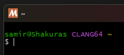
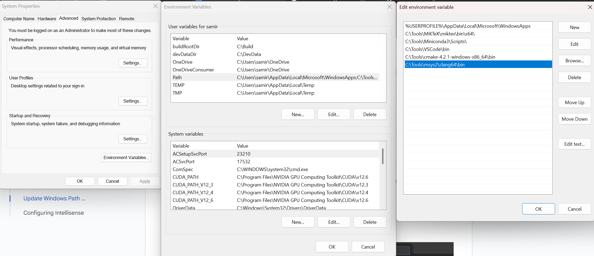
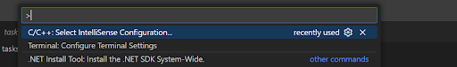
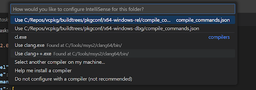

# VSCode and Clang under Windows

## Installing VSCode, MSYS2 & Required Packages

These steps will get the compiler called [clang](https://clang.llvm.org/) and the package and build environment manager msys2 working on your Windows:

* [download](https://code.visualstudio.com/download) & install [VSCode](https://code.visualstudio.com/) which is the [IDE](https://en.wikipedia.org/wiki/Integrated_development_environment) for this tutorial
* [download](https://www.msys2.org/) & install the [MSYS2](https://www.msys2.org/) command line tool for Windows
  * [MSYS2](https://www.msys2.org/) comes with multiple [environments](https://www.msys2.org/docs/environments/) / executables,
  * start the “MSYS2 CLANG64” executable (`<MSYS2 install dir>/clang64.exe`) to work with the environment for the [clang compiler](https://clang.llvm.org/);\
  you should see a [MSYS2](https://www.msys2.org/) window with `username@machine CLANG64 ~` as initial text:
  
  * [pacman](https://www.msys2.org/docs/package-management/) is the package manager within [MSYS2](https://www.msys2.org/) which facilitates getting the headers and binaries you will need
  * [installing a package](https://www.msys2.org/docs/package-management/) in [MSYS2](https://www.msys2.org/docs/package-management/) is done using a command like:\
    `$ pacman -S  <package_name>`
  * finding available packages can be done using a command like:\
    `$ pacman -Ss  <part of the package name>`
  * for example, to find [JsonCpp](https://github.com/open-source-parsers/jsoncpp) libraries, try:\
    `$ pacman -Ss jsoncpp`
  * listing all installed packages can be done using the command:\
    `$ pacman -Q`
* [download](https://www.mingw-w64.org/getting-started/msys2-llvm/) & install the [clang compiler](https://clang.llvm.org/) & [debugger](https://lldb.llvm.org/) from [LLVM](https://llvm.org/)
  * get the [clang compiler](https://clang.llvm.org/) by runing the command inside the [MSYS2](https://www.msys2.org/) environment which downloads and installs it:\
  `$ pacman -S mingw-w64-clang-x86_64-clang`
  * get the [debugger](https://lldb.llvm.org/):
      ([lldb](https://lldb.llvm.org/) is [LLVM](https://llvm.org/)’s debugger):
    `$ pacman -S mingw-w64-clang-x86_64-lldb`
  * outputting the [clang](https://clang.llvm.org/) version can be done using:

    ```bash
    $ clang --version
    clang version 21.1.7
    Target: x86_64-w64-windows-gnu
    Thread model: posix
    InstalledDir: C:/Tools/msys2/clang64/bin
    ```

  * output the [mingw](https://en.wikipedia.org/wiki/MinGW) version using:\
  ([mingw](https://en.wikipedia.org/wiki/MinGW) = Minimalist [GNU](https://en.wikipedia.org/wiki/GNU) for Windows build environment with for example header files to access Windows’ features)

    ```bash
    $ pacman -Qi mingw-w64-clang-x86_64-headers | grep Version
    Version         : 13.0.0.r354.g40ab95d18-1
    ```

* install the [Ninja](https://packages.msys2.org/packages/mingw-w64-clang-x86_64-ninja) build system:
  (schedules the actual building of compile units & is the recommended default build tool for [MSYS2](https://www.msys2.org/) and [CMake](https://cmake.org/); besides, [Ninja](https://packages.msys2.org/packages/mingw-w64-clang-x86_64-ninja) is fast!)
    `$ pacman -S mingw-w64-clang-x86_64-ninja`
* install [CMake](https://cmake.org/) cross-platform build system:
  (generates input files for [Ninja](https://packages.msys2.org/packages/mingw-w64-clang-x86_64-ninja), see overview)
  `$ pacman -S mingw-w64-clang-x86_64-cmake`
  * I prefer the GUI version of [CMake](https://cmake.org/) for a simple overview of all build options of my project:
  `$ pacman -S mingw-w64-clang-x86_64-cmake-gui`
  (then you can run cmake-gui.exe from the [MSYS2](https://www.msys2.org/) environment with [Ninja](https://packages.msys2.org/packages/mingw-w64-clang-x86_64-ninja) to configure your C/C++ project and generate the corresponding files for building)
* optional, install [OpenMP](https://www.openmp.org/about/about-us/):
  (if you want to use somewhat simple/straightforward parallel processing code)
  `$ pacman -S mingw-w64-clang-x86_64-llvm-openmp`

## Setting up Visual Studio Code

The following steps set up [Visual Studio Code](https://code.visualstudio.com/) with the installed [LLVM](https://llvm.org/) compiler infrastructure.

### Update Windows Path Variable

Add the path to the [LLVM](https://llvm.org/) binaries ([clang](https://clang.llvm.org/), [lldb](https://lldb.llvm.org/), etc.) to the Windows system environment path variable (`C:\Tools\msys2\clang64\bin` in my case):

That means `$ clang --version` should work in [VSCode](https://code.visualstudio.com/) terminals or other command line environments.

### Configuring Intellisense

To get compile error hints while you write code, set up Microsoft’s [Intellisense](https://code.visualstudio.com/docs/editing/intellisense).

* press `Ctrl+Shift+P` to open the command palette and choose
`C/C++: Select IntelliSense Configuration…`:

* select [clang++](https://clang.llvm.org/) as compiler executable:
  
* the result of selecting [clang++](https://clang.llvm.org/) is a `c_cpp_properties.json` file in the `.vscode` project folder similar to this:


The important parts are a compiler path pointing to [clang](https://clang.llvm.org/) and a [clang](https://clang.llvm.org/)intellisense mode like above. This one is set up for the c++23 standard. Ignore the defines and include paths which depend on your specific project.

### Telling VSCode the Desired Build Outputs

To tell [VSCode](https://code.visualstudio.com/) what building the binary files means, you need to define tasks to be run.
the [VSCode](https://code.visualstudio.com/)-specific tasks.json file defines what toolchain to run and where
example with separate debug and release binaries for [CMake](https://cmake.org/) and [clang](https://clang.llvm.org/):

this tasks.json file (in the `.vscode` workspace directory) defines where the build data should go and what building means: running the cmake+...+compiler+... toolchain in the respective release/debug folders
each configuration (debug or release) consists of 2 steps:

1) configuring defines how the build is done, e.g., “Configure Base Debug”.
  (a) `-B <build directory>` defines the output directory.
  (*) `-S <source directory>` defines where the main CMakeLists.txt and C++ source code is.
2) building the actual executables is done next using [Ninja](https://packages.msys2.org/packages/mingw-w64-clang-x86_64-ninja), the [clang compiler](https://clang.llvm.org/) & linker, e.g., “Build Base Debug”.
  (*) `--build <build dir>` specifies building (and not configuring).
  (*) `--config` is used to build debug or release binaries using for example specific compiler flags
Not sure why `$gcc` is the problemMatcher
despite that [clang](https://clang.llvm.org/) is used.
The two steps are linked using the `dependsOn` entry saying that the actual build step 2 depends on the configuration step 1.
`${env:buildRootDir}` is a Windows environment variable pointing to the root directory of the builds.

### Debugging with VSCode & LLDB

These steps set up your system for debugging your code using the [LLVM](https://llvm.org/) tool set.
install the [LLVM](https://llvm.org/) [debugger](https://lldb.llvm.org/) plugin for VS code:

create launch targets using a `launch.json` file for easy binary execution or debugging
an example file for release and debug executables:

This one also ensures that the code is built before running the executable using the `preLaunchTask` entries that point to compile jobs from the above tasks.json.
Now you should be able to trigger building and running your executables using the LLVM toolchain using a just keyboard shortcut (`F5` or only building using `Ctrl+Shift+B` by default).
