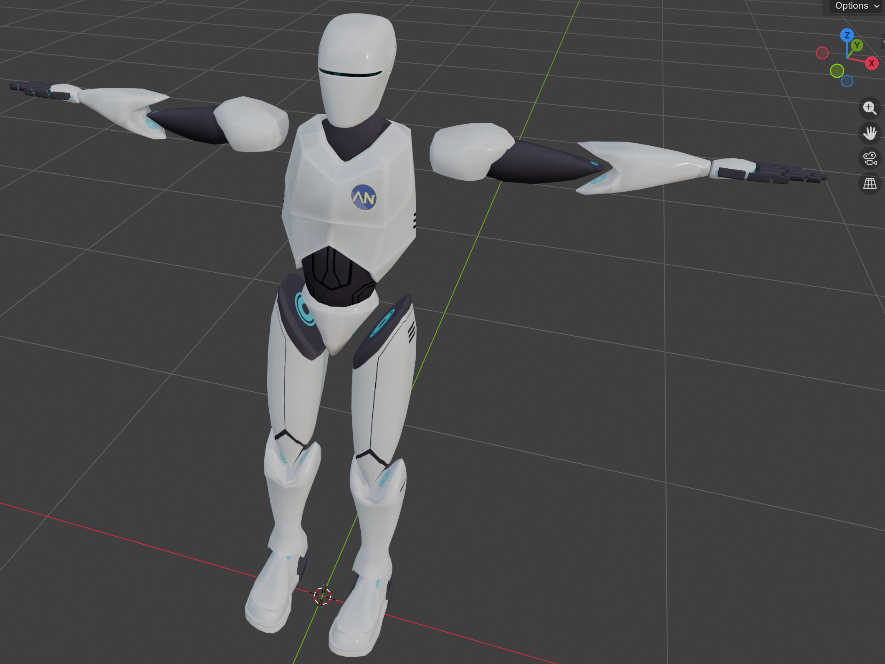
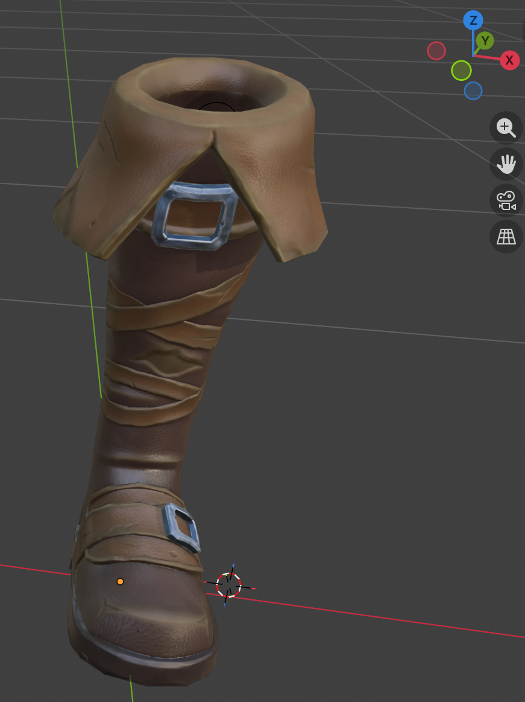
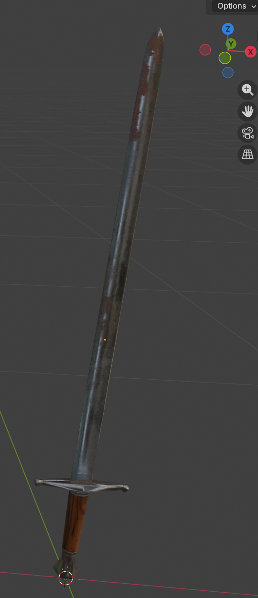
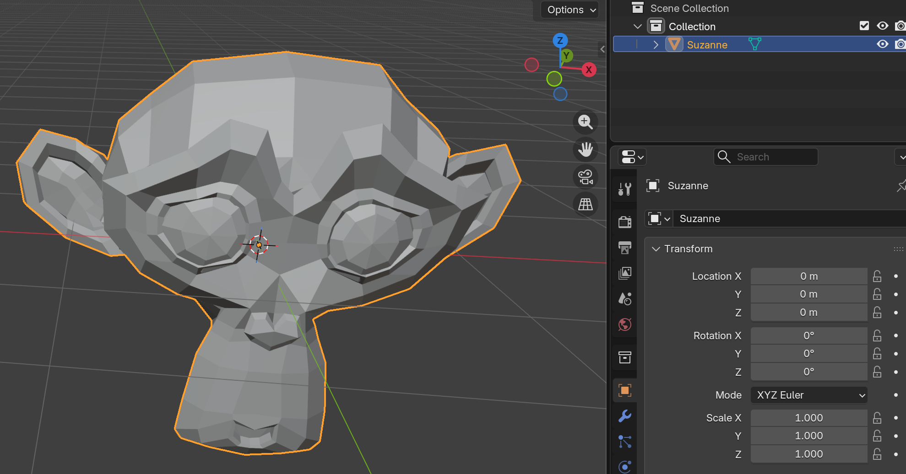
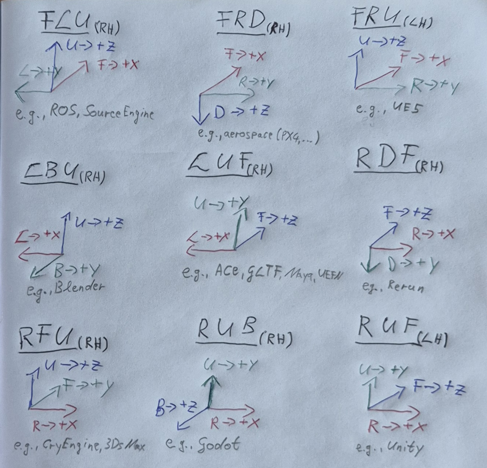

# The Messy Conventions of 3D Basis Systems

A good friend of mine often jokes about
how inconsistent 3D assets and 3D software are.
She is convinced that the common 3D convention chaos
introduces enough bugs into AI training pipelines,
such that this chaos will eventually save humanity from the future
[Skynet](https://en.wikipedia.org/wiki/Skynet_(Terminator)).
My friend is not alone with her pain.
Even people like [Tim Sweeney](https://x.com/TimSweeneyEpic/status/1930678660098408669?lang=en)
find this a huge nuisance.

Though, you might wonder why this is such a big deal as
pretty much everyone knows what left, right, up, down, forward and back mean.
So what is the problem?
When building a 3D application or when training neural networks on 3D assets,
you ideally want the assets of your database to be consistent.
Enforcing this consistency throughout the whole asset database is the first problem.

## Consistent 3D Asset Database

For rigid 3D objects,
you typically want to enforce consistent positioning, size and orientation:

### Positional Consistency
The positional consistency can often be enforced by centering
the axis-aligned bounding box of each mesh at the model space origin.

### Size Consistency
Consistent size is simple (but not easy) to achieve
by matching each 3D model size to its actual real-world size,
e.g., by manually resizing or using metric 3D reconstructions.
The meaning of a floating point unit should also be clear and consistent,
e.g., is 1.0 equal to 1 m, 1 cm or 1 mm?

### Orientation Consistency
Consistent orientation means
that 3D assets of the same "type" are oriented the same way and "aligned".
Hence, it should be clear what left/right (L/R), up/down (U/D), forward/back (F/D)
means in terms of your 3D asset type and
all assets of the same type are placed in model space with matching directions.

If you have a fixed viewing angle for your objects,
consistent orientation might mean something as follows.
Characters might stand upright and face the camera:\
\
Similarly, boots might be oriented like the characters feet,
stand upright and point towards the camera:\
\
Depending on what is useful for your team,
weapons like swords, might also be upright with
the pointy end of the sword going up
and the cross guard and the blade going from left to right:\
\

The exact orientation convention of a 3D asset type does not matter
as much as enforcing it consistently.
If the team agreed on the orientation conventions and if the database is consistent,
then it is much easier to write model training, rendering or simulation code
as it is clear what to expect.

Unfortunately,
there is another big source of confusion and chaos,
even if your 3D asset database is made consistent as explained above.
Even if all characters look forward while standing upright,
they might still be oriented in the wrong way depending
on what set of tools you use.
This is due to the fact that code for handling 3D space is often built on abstract 3D Euclidean space
consisting of x, y and z basis vectors without inherent meaning.

## A Sole 3D Basis is Abstract and Meaningless

Lets assume our 3D space is Euclidean.
It is based on 3 unit-length vectors that are orthogonal to each other,
the typical x-, y- and z-axis system:

* +x = (1, 0, 0), -x = (-1, 0, 0)
* +y = (0, 1, 0), -y = (0, -1, 0)
* +z = (0, 0, 1), -z = (0, 0, -1)

There is fortunately a plethora of informational material
explaining how geometry, transformations, etc. can be defined in such a space.
However, people rarely take the time to clearly define and document what
+x, +y or +z mean in their practical application.

### Blender and LBU
The screenshots of the 3D assets shown above
are all from [Blender](https://www.blender.org/).
The coordinate system basis vectors are visible in the upper right corner.
The circles with the x (red), y (green) and z (blue) indicate the underlying 3D basis vectors.
The ones with the x, y, and z character
indicate the positive direction of each coordinate axis (+x, +y and +z).
In each asset example above,
+x points to the left side of the asset,
+y points to the back asset back side and
+z goes up.
This means the assets follow the mapping:

* left (L) -> +x = (1, 0, 0)
* back (B) -> +y = (0, 1, 0)
* up (U) -> +z = (0, 0, 1)

In short, this is a right-handed left-back-up (LBU) 3D basis
for the example 3D assets above.
This also seems to be the default of [Blender](https://www.blender.org/),
as demonstrated when adding the monkey head "Suzanne" without any custom rotation:\

### Convention Choice Chaos
The big source of confusion is now that
Blender's mapping of +x, +y and +z to LBU is just one of many options.
[GLTF](https://registry.khronos.org/glTF/specs/2.0/glTF-2.0.html#coordinate-system-and-units)
and
[UEFN](https://dev.epicgames.com/documentation/fortnite/leftupforward-coordinate-system-in-unreal-editor-for-fortnite)
in contrast follow the left-up-forward (LUF) convention:

* left (L) -> +x = (1, 0, 0)
* up (U) -> +y = (0, 1, 0)
* forward (F) -> +z = (0, 0, 1)

Many different conventions are in use
since these mapping are just conventions.
No convention is inherently better or worse than any other convention
(as long as the basis consists of orthogonal unit-length vectors).

Here is an overview with (only) 9 example conventions
which are in use by various well-known software:
\
The abbreviations have the following meaning:
* RH = right-handed
* LH = left-handed
* B = back
* D = down
* F = forward
* L = left
* R = right
* U = up

The above naming works well for characters, small scenes or objects.
When referring to maps or world coordinate systems,
the 3D basis conventions are often based on cardinal directions and up/down:
[[29]](https://developer.valvesoftware.com/wiki/Coordinates),
[[39]](https://minecraft.fandom.com/wiki/Coordinates):

* N = North
* S = South
* W = West
* E = East,

This is again only different naming, only a different set of conventions,
and the underlying properties of the 3D basis
like handedness, etc. are the same as for the previous naming conventions.

When you blindly take geometry or transforms defined in one system,
e.g., [Blender](https://www.blender.org/) with LBU and
put them into another system without adapting them,
then the geometry or transforms will be off.
For example, the sword from above has its pointy end facing forward
in a LUF system with the cross guard going from left to right and facing upwards
if the vertex coordinates are not correspondingly adjusted.

### 48 Conventions
If you now wondered how many (non-degenerate) 3D basis conventions there are,
there is the option to map
* +x to left or right (-> x2),
* +y to up or down (-> x2),
* +z to forward or back (-> x2),
* with 6 options to order R/L, U/D and F/B (-> x6)

resulting in 48 unit-length orthogonal combinations of vectors
while having a directional meaning.
Besides, 24 of them are left-handed and the other 24 are right-handed.

## Conventions Used in Practice

Finally, here is an overview listing various well-known software
with its underlying 3D basis conventions to help you know what to expect
and what might be going wrong if your 3D assets or transforms do not look right.

Given the following reference basis:
* +x = (1, 0, 0), -x = (-1, 0, 0)
* +y = (0, 1, 0), -y = ( 0, -1, 0)
* +z = (0, 0, 1), -z = ( 0, 0, -1),

the first table below shows the different commonly encountered conventions:

|Convention | Handedness | left | right | down | up | back | forward |
|---|---|---|---|---|---|---|---|
| FLU | RH | (0,1,0)  | (0,-1,0) | (0,0,-1) | (0,0,1)  | (-1,0,0) | (1,0,0) |
| FRD | RH | (0,-1,0) | (0,1,0)  | (0,0,1)  | (0,0,-1) | (-1,0,0) | (1,0,0) |
| FRU | LH | (0,-1,0) | (0,1,0)  | (0,0,-1) | (0,0,1)  | (-1,0,0) | (1,0,0) |
| LBU | RH | (1,0,0)  | (-1,0,0) | (0,0,-1) | (0,0,1)  | (0,1,0)  | (0,-1,0) |
| LUF | RH | (1,0,0)  | (-1,0,0) | (0,-1,0) | (0,1,0)  | (0,0,-1) | (0,0,1) |
| RDF | RH | (-1,0,0) | (1,0,0)  | (0,1,0)  | (0,-1,0) | (0,0,-1) | (0,0,1) |
| RFU | RH | (-1,0,0) | (1,0,0)  | (0,0,-1) | (0,0,1)  | (0,-1,0) | (0,1,0) |
| RUB | RH | (-1,0,0) | (1,0,0)  | (0,-1,0) | (0,1,0)  | (0,0,1)  | (0,0,-1) |
| RUF | LH | (-1,0,0) | (1,0,0)  | (0,-1,0) | (0,1,0)  | (0,0,-1) | (0,0,1) |
| UFL | RH | (0,0,1)  | (0,0,-1) | (-1,0,0) | (1,0,0)  | (0,-1,0) | (0,1,0) |

The next table shows an overview for various software
to help you quickly see what you should expect and what to work with.
Note that there might be multiple rows for the same software,
if different conventions are used for different entities.
For example, the 3D basis for render cameras might differ from the
3D basis convention for 3D objects/scenes.
There are also a few special cases in the table:

* `???` marks an unknown convention.
  Send a [message](info@acenerds.com) if you know it!
* `?U?` marks a convention where only up = +y is known or consistent.
* `??U` marks a convention where only up = +z is known or consistent.

| Software  | Convention | Handedness | Sources |
|---|---|---|---|
| 3dsMax (scenes) | RFU | RH |[[2]](https://help.autodesk.com/view/GWNAV/ENU/?guid=__nav_help_overview_coordinate_systems_html) |
| 3dsMax (camera) | RUB | RH |[[3]](https://help.autodesk.com/view/3DSMAX/2024/ENU/?guid=GUID-0F3E2822-9296-42E5-A572-B600884B07E3) |
| Ace | LUF | RH |[[1]](https://github.com/SamirAroudj/AceNerds/blob/main/ACEs/01Conventions/README.md) |
| Anno | ??? | ?? | [[4]](https://www.anno-union.com/devblog-the-anno-engine/) |
| Anvil| ??? | ?? | [[5]](https://en.wikipedia.org/wiki/Ubisoft_Anvil) |
| ARKit | RUB | RH | [[6]](https://developer.apple.com/documentation/arkit/understanding-world-tracking) |
| Autodesk AutoCAD | ??U | RH | [[47]](https://help.autodesk.com/view/ACD/2024/ENU/?guid=GUID-E658D5E7-EE5C-4A06-BF34-F71CDB363A71) |
| Blender (scenes) | LBU | RH | [[7]](https://docs.blender.org/manual/en/2.91/editors/3dview/navigate/viewpoint.html), [[8]](https://en.wikibooks.org/wiki/Blender_3D:_Noob_to_Pro/Understanding_Coordinates), [[9]](https://github.com/SamirAroudj/AceNerds/tree/main/Software/03TheMessOf3DBases#blender-and-lbu)|
| Blender (camera) | RUB | RH |[[10]](https://devtalk.blender.org/t/paper-cut-the-cameras-default-rotation-is-facing-down/13677/3)|
| Cinema 4D | RUF | LH | [[46]](https://developers.maxon.net/docs/py/2024_4_0a/manuals/manual_matrix.html) |
| Colmap (camera) | RDF | RH | [[11]](https://colmap.github.io/format.html#images-txt) |
| CryEngine | RFU | RH | [[12]](https://www.cryengine.com/docs/static/engines/cryengine-5/categories/23756813/pages/26871453#coordinate-system) |
| Frostbite | ??? | ?? | [[13]](https://en.wikipedia.org/wiki/Frostbite_(game_engine)) |
| GLTF (scenes) | LUF | RH | [[14]](https://registry.khronos.org/glTF/specs/2.0/glTF-2.0.html#coordinate-system-and-units) |
| GLTF (camera) | RUB | RH | [[15]](https://github.khronos.org/glTF-Tutorials/gltfTutorial/gltfTutorial_016_Cameras.html) |
| Godot (objects) | LUF | RH | [[41]](https://docs.godotengine.org/en/stable/tutorials/assets_pipeline/importing_3d_scenes/model_export_considerations.html#d-asset-direction-conventions)|
| Godot (world) | EUS | RH | [[41]](https://docs.godotengine.org/en/stable/tutorials/assets_pipeline/importing_3d_scenes/model_export_considerations.html#d-asset-direction-conventions)|
| Godot (camera) | RUB | RH | [[16]](https://docs.godotengine.org/en/latest/tutorials/3d/using_transforms.html#introducing-transforms), [[40]](https://docs.godotengine.org/en/stable/classes/class_basis.html) |
| Houdini (scenes) | LUF | RH | [[18]](https://www.sidefx.com/docs/houdini/unreal/coordinates.html) |
| Houdini (camera) | RUB | RH | [[19]](https://www.sidefx.com/forum/topic/69440/#post-302153) |
| LightWave3D | RUF | LH | [[43]](https://docs.lightwave3d.com/2025/getting-started-with-layout.html#world-and-local-axes) |
| Maya | LUF | RH | [[20]](https://help.autodesk.com/view/MAYAUL/2024/ENU/?guid=GUID-DAB331B4-7623-4810-9740-DB526F85333F) |
| MeshLab | ?U? | RH | [[42]](https://www.meshlab.net/) |
| Minecraft (local) | LUF | RH | [[39]](https://minecraft.fandom.com/wiki/Coordinates) |
| Minecraft (world) | EUS | RH | [[39]](https://minecraft.fandom.com/wiki/Coordinates) |
| Modo | ?U? | RH | [[45]](https://learn.foundry.com/modo/12.2/content/help/pages/tutorials/beginner_tutorial.html) |
| Ogre3D | RUB | RH | [[21]](https://ogrecave.github.io/ogre/api/14/tut__first_scene.html), [[22]](https://wiki.ogre3d.org/Simple+3rd+person+camera) |
| OpenCV (camera) | RDF | RH | [[23]](https://docs.opencv.org/4.13.0/d9/d0c/group__calib3d.html) |
| Quake III Arena | FLU | RH | [[24]](https://github.com/id-Software/Quake-III-Arena/blob/master/code/bspc/l_math.c) |
| Rerun | RDF | RH | [[25]](https://rerun.io/docs/reference/types/archetypes/view_coordinates), [[26]](https://ref.rerun.io/docs/python/0.8.0/common/transforms/#rerun.log_pinhole) |
| ROS | FLU | RH | [[27]](https://wiki.ros.org/tf/Overview/Transformations) |
| SketchUp | ??U | RH | [[48]](https://help.sketchup.com/en/sketchup/moving-entities-around) |
| Snowdrop | ??? | ?? | [[28]](https://en.wikipedia.org/wiki/Snowdrop_(game_engine)) |
| Source Engine (local) | FLU | RH | [[29]](https://developer.valvesoftware.com/wiki/Coordinates) |
| Source Engine (world) | ENU | RH | [[29]](https://developer.valvesoftware.com/wiki/Coordinates) |
| Substance 3D Painter | LUF | RH | [[44]](https://helpx.adobe.com/substance-3d-stager/desktop/features/coordinate-system.html) |
| ThreeJS (scenes from GLTF) | LUF | RH | [[30]](https://registry.khronos.org/glTF/specs/2.0/glTF-2.0.html#coordinate-system-and-units) |
| ThreeJS (camera) | RUB | RH | [[31]](https://threejs.org/manual/#en/fundamentals) |
| UEFN | LUF | RH | [[32]](https://dev.epicgames.com/documentation/en-us/fortnite/leftupforward-coordinate-system-in-unreal-editor-for-fortnite) |
| Unity | RUF | LH | [[33]](https://docs.unity3d.com/Simulation/manual/author/working-with-coordinate-spaces.html), [[34]](https://discussions.unity.com/t/how-to-get-the-look-or-forward-vector-of-the-camera/14658) |
| Unreal Engine 5 | FRU | LH | [[35]](https://dev.epicgames.com/documentation/en-us/unreal-engine/coordinate-system-and-spaces-in-unreal-engine) |
| USD (default) | RUB | RH | [[36]](https://openusd.org/dev/user_guides/render_user_guide.html#configuring-the-stage-coordinate-system)  |
| USD (alt.) | RFU | RH | [[36]](https://openusd.org/dev/user_guides/render_user_guide.html#configuring-the-stage-coordinate-system) |
| USD (camera) | RUB | RH | [[36]](https://openusd.org/dev/user_guides/render_user_guide.html#configuring-the-stage-coordinate-system) |
| ZBrush | RUF | LH | [[37]](https://www.youtube.com/watch?v=l7cjQ_lNu4k&t=49s), [[38]](https://www.youtube.com/watch?v=HgWuYEjyoGM)|

**Fun fact**:\
Left-handed coordinate systems are less common when looking at the software overview.
Presumably, that is due to the fact that most educational material assumes right-handed systems.
However, Unity and UE5 are the most commonly licensed game engines.
Both engines are based on left-handed 3D bases.

**If you know more**:\
Hopefully, knowing these conventions will speed up your development and save you debugging time.
If you find a mistake or an important engine, tool or library missing,
send a [message](info@acenerds.com) or
create a pull request with the convention system the missing software follows!

**PS:**\
Protect humanity and do not share this with the makers of
[Skynet](https://en.wikipedia.org/wiki/Skynet_(Terminator))!